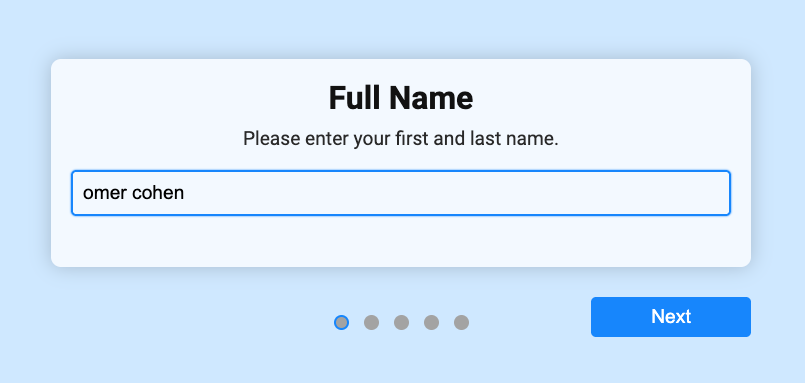

# Wizard Form Component – Home Assignment

**Author**: Idn Berger  
**Submitted to**: Ecton Company

This project is a home assignment implementing a **multi-step wizard form** component using **React**, **TypeScript**, **Vite**, and **SCSS**. It includes form handling, validation, and a smooth user experience across steps.

## 🛠 Tech Stack

- **React** (with hooks)
- **TypeScript**
- **Vite** (build tool)
- **SCSS** (styling)
- **React Hook Form** or custom form handling
- **Yup / Zod** (optional: for validation schema)

## 🚀 Getting Started

To run the project locally:

1. **Clone the repository:**
git clone https://github.com/idanberger22/home-assignment.git
2. **Install dependencies:**
npm i
3. **Run locally:**
npm run dev

